# Library Reactive Stack – Example Implementation for OAuth2 Authentication (with PKCE)

This project is a reactive library management system built with Spring WebFlux, Spring Security (Reactive), and OAuth2 / OpenID Connect.
It demonstrates a non-blocking architecture using the Authorization Code Flow with PKCE, backed by Keycloak as the identity provider.

Hint:
Although this example implementation uses Reactive WebFlux, it still renders blocking Thymeleaf templates.
Even though server-side template rendering does not represent a public client, it is nevertheless treated as a public client by enabling PKCE.

## Project Structure (MonoRepo)

| Module               | Description                                                              |
|----------------------|--------------------------------------------------------------------------|
| **library-commons**  | Shared domain classes, DTOs, and utilities                               |
| **library-backend**  | Reactive backend service acting as an OAuth2 resource server             |
| **library-frontend** | Reactive frontend web application acting as an OAuth2 client (with PKCE) |

## Components Overview

| Layer                             | Component                                                | Purpose                                                                                                                              |
|-----------------------------------|----------------------------------------------------------|--------------------------------------------------------------------------------------------------------------------------------------|
| **Frontend (`library-frontend`)** | Spring Boot WebFlux + Reactive OAuth2 Client (with PKCE) | Authenticates users via OIDC using the Authorization Code Flow with PKCE, then calls the backend using `WebClient` and Bearer Tokens |
| **Backend (`library-backend`)**   | Spring Boot WebFlux Resource Server                      | Validates incoming JWTs using a `ReactiveJwtDecoder` against the JWKS from the authorization server                                  |
| **Authorization Server** (docker) | Keycloak                                                 | Performs login, issues Access/ID Tokens, and provides public keys via JWKS                                                           |
| **Database** (docker)             | MySQL                                                    | Stores Keycloak and Library data                                                                                                     |~~
| **User (Browser)**                | Web Client                                               | Interacts with the application and accesses protected data                                                                           |

## Core Spring Components per Module

| Module               | Area                     | Key Classes / Beans                                                                                                                             | Purpose                                                                                           |
|----------------------|--------------------------|-------------------------------------------------------------------------------------------------------------------------------------------------|---------------------------------------------------------------------------------------------------|
| **library-frontend** | **Security (Reactive)**  | `SecurityWebFilterChain` (with `.oauth2Login()` + PKCE), `ReactiveClientRegistrationRepository`, `ServerOAuth2AuthorizedClientRepository` | Handles OIDC login with PKCE, stores tokens reactively within the `ReactiveSecurityContextHolder` |
|                      | **Web / Controller**     | `@Controller`, `@GetMapping`, `Mono<Rendering>`                                                                                                 | Renders HTML using Thymeleaf Reactive or returns JSON responses                                   |
|                      | **Service / API Calls**  | `WebClient` + `ServerOAuth2AuthorizedClientExchangeFilterFunction`                                                                              | Calls the `library-backend` API reactively using Bearer Tokens                                    |
|                      | **Configuration**        | `application.yml` with `spring.security.oauth2.client.registration.*`                                                                           | Defines client ID, secret, scopes, redirect URIs, and PKCE enforcement                            |
| **library-backend**  | **Security (Reactive)**  | `SecurityWebFilterChain` (with `.oauth2ResourceServer().jwt()`), `ReactiveJwtDecoder` (Nimbus), `ReactiveJwtAuthenticationConverter`      | Reactively validates JWTs and maps claims to authorities                                          |
|                      | **Web / REST API**       | `@RestController`, `@GetMapping`, `Mono<ResponseEntity<?>>`                                                                                     | Exposes protected reactive REST endpoints (e.g. `/api/books`, `/api/users`)                       |
|                      | **Data / Service Layer** | `@Service`, `ReactiveCrudRepository`, R2DBC entities                                                                                            | Handles business logic and reactive database access                                               |
|                      | **Configuration**        | `application.yml` with `spring.security.oauth2.resourceserver.jwt.jwk-set-uri`                                                                  | Defines JWKS URI for token signature validation                                                   |

## Architecture Diagram

```mermaid
flowchart TB
%% --- FRONTEND ---
    subgraph FRONTEND["💻 library-frontend (Spring WebFlux + OAuth2 Client + PKCE)"]
        F1["SecurityWebFilterChain + oauth2Login()"]
        F2["WebClient (mit OAuth2AuthorizedClient)"]
        F3["Thymeleaf"]
        F4["PKCE: code_challenge, code_verifier"]
    end

%% --- BACKEND ---
    subgraph BACKEND["⚙️ library-backend (Spring WebFlux Resource Server)"]
        B1["SecurityWebFilterChain + oauth2ResourceServer().jwt()"]
        B2["ReactiveJwtDecoder (Nimbus)"]
        B3["Reactive Controllers (/api/books, /api/users)"]
    end

%% --- AUTH SERVER ---
    subgraph AUTH["🛡️ Authorization Server (Keycloak / OIDC Provider)"]
        A0["/.well-known/openid-configuration"]
        A1["/authorize (mit PKCE, scope=openid profile email)"]
        A2["/token (verifiziert code_verifier)"]
        A3["/userinfo (Access Token → User Claims)"]
        A4["/.well-known/jwks.json"]
    end

%% --- USER ---
    subgraph USER["👤 Benutzer / Browser"]
        U1["Browser"]
    end

%% --- FLOWS ---
    U1 -->|"1️⃣ GET /books"| FRONTEND
    FRONTEND -->|"2️⃣ Redirect /authorize (mit code_challenge)"| AUTH
    AUTH -->|"3️⃣ Login"| U1
    AUTH -->|"4️⃣ Authorization Code"| FRONTEND
    FRONTEND -->|"5️⃣ POST /token (mit code_verifier)"| AUTH
    AUTH -->|"6️⃣ Access Token + ID Token (OIDC)"| FRONTEND
    FRONTEND -->|"7️⃣ (optional) /userinfo (Bearer Token)"| AUTH
    FRONTEND -->|"8️⃣ WebClient → /api/books (Bearer Token)"| BACKEND
    BACKEND -->|"9️⃣ Validate JWT via JWKS"| AUTH
    BACKEND -->|"🔟 JSON Books"| FRONTEND
    FRONTEND -->|"🏁 Render Thymeleaf Templates"| U1

%% --- STYLING ---
    classDef comp fill:#f6f8fa,stroke:#ccc,stroke-width:1px,rx:8px,ry:8px;
    class FRONTEND comp;
    class BACKEND comp;
    class AUTH comp;

```

## OAuth2 Sequence Diagram

